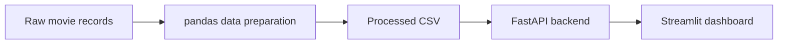

# Full-Stack Movies

A Python portfolio project connecting movie data preparation with a REST API, an interactive web framework, and cloud infrastructure configuration.

I built this project to bring data engineering and application development together: preparing movie records with pandas, serving the resulting dataset through FastAPI, and displaying it in a Streamlit dashboard. Separate Docker images and Terraform configurations extend the project to container orchestration and Azure infrastructure as code.

## Project overview

The application presents movie titles, genres, release dates, and IMDb ratings in a table. Behind the interface, a file-based data workflow transforms raw records into a consistent dataset consumed by the API.

## Data engineering

The data preparation code handles raw records stored as one Python dictionary literal per line. It parses these records with `ast.literal_eval` and builds a pandas DataFrame for transformation.

The workflow:

- Selects movie identifiers, titles, genres, release dates, and ratings.
- Standardizes column names to `imdb_id`, `primary_title`, `genres`, `release_date`, and `imdb_rating`.
- Removes records with missing ratings or release dates.
- Exports the prepared dataset to CSV for the backend.
- Restores serialized genre values to Python lists when loading the CSV for API responses.

This creates a clear boundary between data preparation and the application that consumes the results.

### Exploratory analysis

The [EDA notebook](eda_imdb.ipynb) explores missing values, input parsing, and nested cast records. It uses `pd.json_normalize` to flatten cast data, selects actors and actresses, and joins those records to movie information.

This exploration produces a separate movie-and-actor export. The dashboard uses the smaller, five-column dataset produced by the backend preparation script.

## Backend and frontend

The **FastAPI backend** loads the processed dataset into memory and exposes it through `GET /imdb_action_movies`. The endpoint returns JSON records and supports a row limit, with 30 records returned by default.

The **Streamlit frontend** retrieves these records with HTTPX and displays them in a table, alongside a movie banner and data-source attribution. An environment variable configures the backend address for local containers and the Azure application configuration.

The view is titled “Action movies”; genre selection is determined by the supplied dataset, as the application does not apply a genre filter.

## Containers and cloud infrastructure

The project includes separate **Dockerfiles** for the backend and frontend, both based on Python 3.13. **Docker Compose** connects the services and uses a backend health check to control frontend startup. The processed dataset is packaged with the backend image.

The **Terraform configuration** is split into registry and application resources:

| Area | Infrastructure defined in code |
| --- | --- |
| Registry | Azure resource group and Basic-tier Azure Container Registry |
| Application hosting | Azure Container Apps environment and separate backend and frontend apps |
| Image access | User-assigned managed identity with a registry-scoped `AcrPull` role |
| Service connection | Frontend backend URL configured from the backend's HTTPS ingress address |

These configurations demonstrate the intended Azure deployment architecture. A Log Analytics workspace is also declared, although it is not connected to the Container Apps environment in the current code.

## Technology stack

| Area | Tools |
| --- | --- |
| Language | Python |
| Data preparation and analysis | pandas, Jupyter |
| API | FastAPI, Uvicorn |
| Frontend | Streamlit, HTTPX |
| Dependency management | uv workspace and lockfile |
| Containers | Docker, Docker Compose |
| Infrastructure | Terraform, Azure Container Registry, Azure Container Apps |

## Code highlights

| Component | Source |
| --- | --- |
| Data cleaning and CSV export | [data_prep.py](backend/src/backend/data_prep.py) |
| Dataset loading and genre parsing | [data_processing.py](backend/src/backend/data_processing.py) |
| REST endpoint | [api.py](backend/src/backend/api.py) |
| Dashboard | [dashboard.py](frontend/src/frontend/dashboard.py) |
| Exploratory analysis and cast normalization | [eda_imdb.ipynb](eda_imdb.ipynb) |
| Service orchestration | [docker-compose.yaml](docker-compose.yaml) |
| Container images | [dockerfiles](dockerfiles) |
| Azure infrastructure | [infra](infra) |

## Project scope

This is a personal portfolio project with manual data preparation, CSV storage, a read-only API, and a tabular frontend. The infrastructure is represented by Terraform configuration; a live deployment is not documented here. Data files are excluded from the repository.

Movie data is attributed in the application to IMDb via RapidAPI. This project is not affiliated with or endorsed by IMDb.
