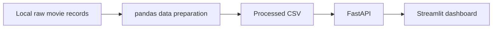

# Full-Stack Movies

A Python portfolio project that takes locally supplied movie records through data preparation, a REST API, and a web dashboard. It combines pandas transformations with FastAPI, Streamlit, Docker Compose, and Terraform configuration for Azure Container Apps.

The project demonstrates the connection between preparing a dataset and making it available through an application. Its current scope is a file-based workflow with a single read endpoint and a tabular dashboard.

## Architecture



- **Data preparation:** reads one Python dictionary literal per line from a local file, selects five fields, renames columns, and removes records missing a rating or release date.
- **Backend:** loads the processed CSV into memory at import time, converts serialized genre lists back to Python lists, and returns movie records as JSON.
- **Frontend:** requests data from the backend and displays it in a Streamlit table with a banner image and source attribution.
- **Containers:** separate Python 3.13 images for the backend and frontend; Compose configures service communication and waits for the backend health check before starting the frontend.
- **Azure infrastructure:** Terraform defines a container registry and two Container Apps, with a user-assigned identity for registry image pulls.

The dashboard and endpoint use the name “Action movies.” The application code does not filter by genre; it serves the supplied processed dataset in its existing order.

## Technology stack

| Layer | Technologies |
| --- | --- |
| Data preparation and exploration | pandas, Python `ast`, Jupyter notebook |
| API | FastAPI, Uvicorn |
| Dashboard | Streamlit, HTTPX |
| Python environment | Python 3.13+, uv workspace, root `uv.lock` |
| Local containers | Docker, Docker Compose |
| Infrastructure as code | Terraform, Azure Container Registry, Azure Container Apps |

## Data workflow

The application expects these local files:

```text
backend/data/raw/imdb_movies.json
backend/data/processed/imdb_movies.csv
```

Despite its `.json` extension, the raw input is expected to contain one **Python dictionary literal per line**, parsed with `ast.literal_eval`. It is not a conventional JSON Lines reader. The dashboard attributes the movie data to IMDb via RapidAPI; the repository does not include a download client or instructions for a specific source endpoint.

`backend/src/backend/data_prep.py` produces the following schema:

| Output field | Source field | Processing |
| --- | --- | --- |
| `imdb_id` | `id` | Renamed |
| `primary_title` | `primaryTitle` | Renamed |
| `genres` | `genres` | Written to CSV; parsed back into lists by the backend |
| `release_date` | `releaseDate` | Renamed; rows with missing values removed |
| `imdb_rating` | `averageRating` | Renamed; rows with missing values removed |

The preparation script does not deduplicate records, validate date formats, or apply a genre filter. Data preparation is a manual step; starting the API does not regenerate the CSV.

### Exploratory analysis

[`eda_imdb.ipynb`](eda_imdb.ipynb) explores input parsing, missing values, column selection, and nested cast data. It uses `pd.json_normalize` to flatten cast records, selects actors and actresses, and joins them to movie records before exporting a separate root-level `imdb_movies.csv`.

That export is distinct from the processed CSV consumed by the API. The notebook retains exploratory cells, including an unsuccessful JSON-reading approach and list/DataFrame experimentation, so it should be reviewed interactively rather than treated as an automated pipeline.

## Run locally

### Prerequisites

- Python 3.13 or later and uv.
- A compatible raw dataset, or an already prepared CSV with the schema above.
- Docker with Compose if using the container option.

**Data files are excluded from Git.** A fresh clone does not include the input or processed dataset, and the backend requires the processed CSV to start.

From the repository root:

```bash
uv sync --all-packages --locked
mkdir -p backend/data/raw backend/data/processed
```

Place your compatible input file at `backend/data/raw/imdb_movies.json`, then prepare it:

```bash
uv run --package backend python -m backend.data_prep
```

Alternatively, place a compatible processed CSV directly at `backend/data/processed/imdb_movies.csv`. Its `genres` values must be serialized Python lists, such as `['Action', 'Drama']`.

Start the API:

```bash
uv run --package backend uvicorn backend.api:app --host 127.0.0.1 --port 8000
```

In a second terminal, from the repository root, start the dashboard:

```bash
uv run --package frontend streamlit run frontend/src/frontend/dashboard.py
```

- Dashboard: [localhost:8501](http://localhost:8501)
- API documentation: [localhost:8000/docs](http://localhost:8000/docs)
- Movie records: [localhost:8000/imdb_action_movies](http://localhost:8000/imdb_action_movies)

The frontend reads `BACKEND_URL`, defaulting to `http://127.0.0.1:8000`. Set it when the backend runs at a different address.

## API

### `GET /imdb_action_movies`

Returns an array of records with the five processed fields above.

| Query parameter | Default | Behavior |
| --- | --- | --- |
| `limit` | `30` | Returns the first N rows; zero or a negative integer returns all rows |

```bash
curl 'http://localhost:8000/imdb_action_movies?limit=5'
```

The dashboard sends no `limit` parameter, so it displays the first 30 records by default. The endpoint has no pagination offset, search, sorting, or genre filtering.

## Run with Docker Compose

Prepare `backend/data/processed/imdb_movies.csv` **before building**. The backend image copies the backend directory, including the processed data. Raw data is excluded by `.dockerignore`; Compose does not mount a dataset volume.

```bash
docker compose build
docker compose up --pull never
```

The services expose ports `8000` and `8501`. Compose sets `BACKEND_URL=http://backend:8000` and checks `/imdb_action_movies` for backend readiness.

Images are tagged `moviesregistry.azurecr.io/backend:${IMAGE_TAG:-v1}` and `moviesregistry.azurecr.io/frontend:${IMAGE_TAG:-v1}`. The commands above build and use them locally. Both services target `linux/amd64`, which may require emulation on other architectures.

Rebuild the backend image after changing its packaged dataset. The Dockerfiles install dependencies from each package's `pyproject.toml`; they do not copy or enforce the root workspace lockfile.

To stop the services:

```bash
docker compose down
```

## Azure infrastructure

Terraform is organized into two separate configurations:

| Directory | Defined resources |
| --- | --- |
| [`infra/registry`](infra/registry) | Resource group and Basic-tier Azure Container Registry; default location `francecentral` |
| [`infra/apps`](infra/apps) | Container Apps environment, backend and frontend apps, user-assigned identity, registry-scoped `AcrPull` role assignment, and a Log Analytics workspace |

The application configuration looks up an existing resource group and registry. Both apps use external ingress, with target ports `8000` and `8501`; each container is configured with 1 CPU and 2 GiB of memory. Terraform sets the frontend's `BACKEND_URL` to the backend's HTTPS ingress address. The `image_tag` variable defaults to `v1`.

These files describe deployment infrastructure; they are not evidence of a currently running deployment. Before using them:

- Review the registry settings: the registry resource is named `moviesregistry`, while the application lookup defaults to `moviesRegistry`. Container image URLs are hard-coded to `moviesregistry.azurecr.io`.
- Provision the registry before the application resources, and build and push matching images separately. Terraform does not build or publish images.
- Review the AzureRM provider constraint (`~>5.0.0`) and validate both configurations in your environment.
- Connect the Log Analytics workspace if environment log collection is required; it is declared but not linked to the Container Apps environment in the current configuration.

## Repository structure

```text
.
├── backend/
│   ├── pyproject.toml
│   └── src/backend/
│       ├── api.py                 # Movie endpoint
│       ├── constants.py           # Raw and processed data paths
│       ├── data_prep.py           # Raw records to processed CSV
│       └── data_processing.py     # CSV loading and genre parsing
├── frontend/
│   ├── assets/action_movies.png
│   ├── pyproject.toml
│   └── src/frontend/
│       ├── dashboard.py           # Streamlit table and API request
│       └── image_path_helper.py
├── dockerfiles/                   # Backend and frontend Dockerfiles
├── infra/
│   ├── registry/                  # Resource group and registry
│   └── apps/                      # Container Apps and supporting resources
├── docker-compose.yaml
├── eda_imdb.ipynb
├── pyproject.toml                 # uv workspace definition
└── uv.lock
```

## Current scope

This is a personal learning and portfolio project demonstrating data preparation, API delivery, a Python frontend, container orchestration, and Azure infrastructure configuration. The repository has no database, scheduled ingestion, authentication, automated test suite, or CI/CD workflow. The dashboard makes a direct API request without custom error handling, and the backend keeps the dataset in memory until restarted.

Movie data is attributed in the application to IMDb via RapidAPI. This project is not affiliated with or endorsed by IMDb.
